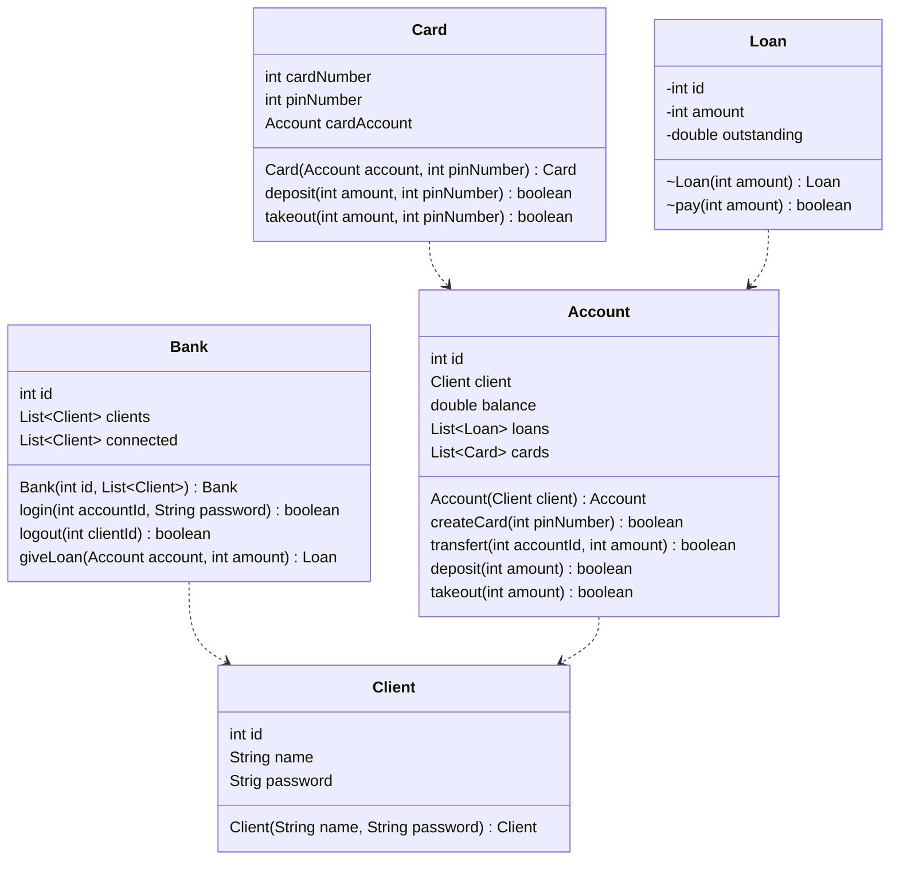

# Git Hooks

Little project to show our understanding of git's hook system.


## Installation

To initialise the project with git, run this command in the local repository :

```bash
  git config core.hooksPath .hooks
```

    
## Running Tests

To run tests, run the following command :

```bash
  npm run test
```


## Documentation

Class diagram of the solution.



## Screenshots
Screenshot of the interface :


## Authors

- [@Anna TYLKOWSKA](https://www.github.com/annaty)
- [@Clément LO-CASCIO](https://www.github.com/ClemLcs)
- [@Eloise LE BLANC](https://www.github.com/eloiseLBC)
- [@Clément LAFON](https://www.github.com/L-Clem)

