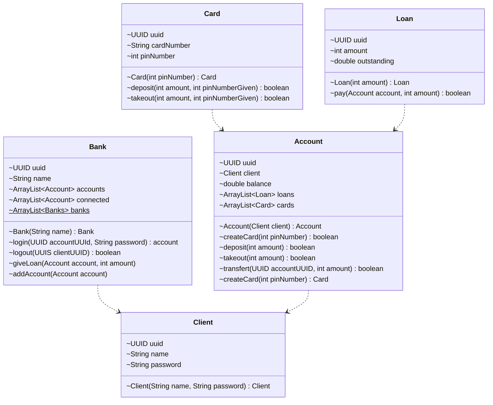

# Git Hooks

Little project to show our understanding of git's hooks system.

The project isn't runing with a database in mind, so the classes tries to reflect what it's relational DB would have been.


## Documentation

### Installation

To initialise the git hooks of the project, run this command in the local repository's root:

```bash
  git config core.hooksPath .hooks
```

### Git hooks list
- Commit: 
  - `commit-msg`: Run PreCommit.java and pass commit path to it.
  - `PreCommit.java`: Test the commit message against the defined schema (cf. Commits section).
- Pre-Push:
  - `pre-push`: Build classes and then run `PrePush.java`.
  - `PrePush.java`: Verify JUnit5 tests.

### Commits

⚠️ Attention, your commits will have to follow this syntax:

```txt
<gitmoji1, gitmoji2...> (scope1, scope2...): Message
```
Exemple with [Gitmoji](https://gitmoji.dev/):
```txt
🎨, ⚡️ (dev, card): Add card to something
```

### Running Tests

To run tests, run the following commands:

```bash
  find [pathToProject]/src -name "*.java" > [pathToProject]/.hooks/sources.txt
  javac -d [pathToProject]/target -cp target:[pathToProject]/.hooks/junit-platform-console-standalone-1.9.1.jar @[pathToProject]/.hooks/sources.txt
  java -jar [pathToProject]/.hooks/junit-platform-console-standalone-1.9.1.jar --class-path [pathToProject]/target --scan-class-path
```

### Class diagram

Class diagram of the solution:



## Screenshots
Screenshot of the interface:


## Authors

- [@Anna TYLKOWSKA](https://www.github.com/annaty)
- [@Clément LO-CASCIO](https://www.github.com/ClemLcs)
- [@Eloise LE BLANC](https://www.github.com/eloiseLBC)
- [@Clément LAFON](https://www.github.com/L-Clem)

