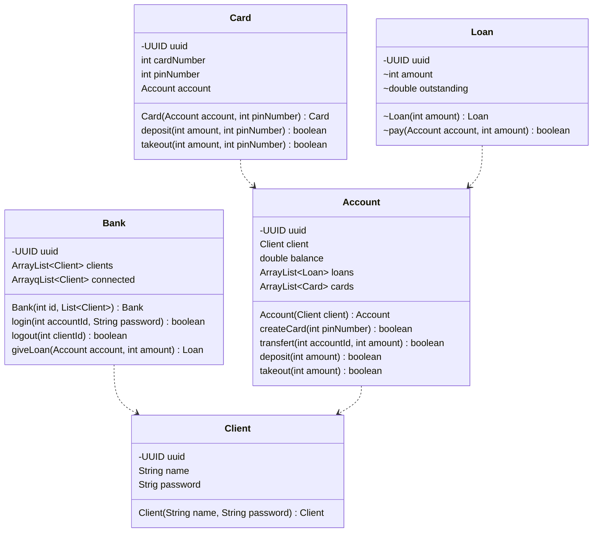

# Git Hooks

Little project to show our understanding of git's hook system.

## Commits

Attention, your commits will have to follow this syntax:

```txt
<gitmoji1, gitmoji2...> (scope1, scope2...): Message
```
Exemple with [Gitmoji](https://gitmoji.dev/):
```txt
🎨, ⚡️ (dev, card): Add card to something
```

## Installation

To initialise the project with git, run this command in the local repository:

```bash
  git config core.hooksPath .hooks
```

    
## Running Tests

To run tests, run the following command:

```bash
  npm run test
```


## Documentation

### Git hooks list
- Commit: 
  - commit-msg: Run PreCommit.java and pass commit path to it.
  - PreCommit.java: Test the commit message against the defined schema (cf. Commits section).
- Pre-Push:
  - pre-push: Run PrePush.java.
  - PrePush.java: WIP.

### Class diagram

Class diagram of the solution:



## Screenshots
Screenshot of the interface:


## Authors

- [@Anna TYLKOWSKA](https://www.github.com/annaty)
- [@Clément LO-CASCIO](https://www.github.com/ClemLcs)
- [@Eloise LE BLANC](https://www.github.com/eloiseLBC)
- [@Clément LAFON](https://www.github.com/L-Clem)

